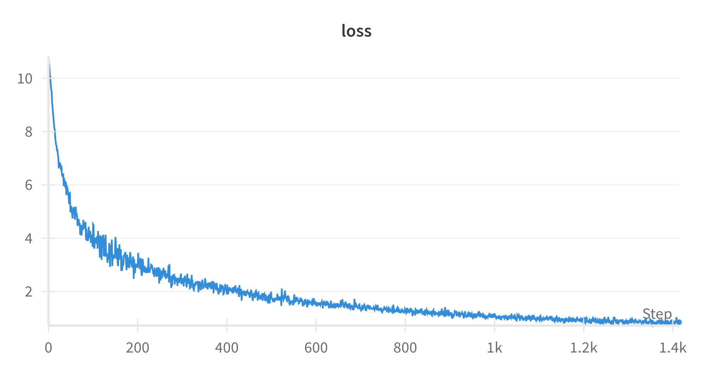

# Model Results

This README provides an overview of the model's results and includes a graph of the loss over time.

## Loss Graph

Below is a graph showing the model's loss during training:

## Description

The graph above visualizes the training loss of the model. Monitoring the loss can help in understanding how well the model is learning over time. A decreasing loss trend typically indicates that the model is improving its performance.

## Additional Resources

You can study the graph and explore more details about the training process using the following link:

[W&B Run Workspace](https://wandb.ai/singye-college-of-science-and-technology/mini-gpt-language-model/runs/16z8nmz5/workspace?nw=nwusersingye)